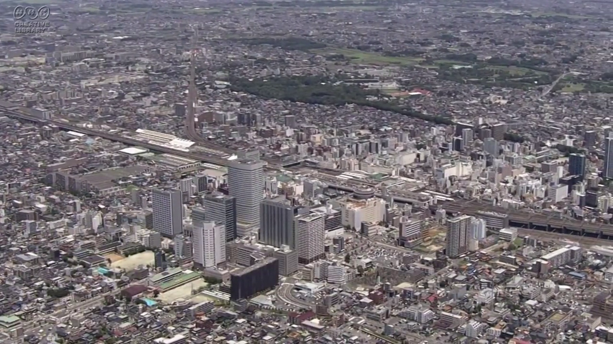

# libcas_plugin
[VLC media player](https://www.videolan.org/vlc/) 用の [FidelityFX CAS](https://github.com/GPUOpen-Effects/FidelityFX-CAS) プラグイン。  

## 動作確認環境  
VLC media player Version 3.0.18 Windows 64bit  

## ビルド環境  
Visual Studio 2022 v17.4.5  
FidelityFX CAS v1.0  
VLC media player SDK Version 3.0.18  
Windows Implementation Libraries v1.0.230202.1  

## 使用方法
libcas_plugin.dll を plugins\video_filter ディレクトリにコピーする。  
VLC media playerを起動し、メニューから『ツール (S)』、『設定 (P)』を選択し、『シンプルな設定』ウィンドウを出す。  
左下の『設定の表示』グループの『すべて』を選択し、『詳細設定』ウィンドウに変更する。  
左の『ビデオ』→『フィルター』を選択し、右の『FidelityFX CAS』にチェックを入れる。  
左の『ビデオ』→『フィルター』→『FidelityFX CAS』を選択し、各項目を設定する。  
- Adapter: 0以上の整数でディスプレイアダプタを指定する
- Sharpness: 0以上1以下の浮動小数点数で、大きいほど先鋭的な画像になる
- FP16: 半精度浮動小数点数での計算を試みる

VLC media playerを終了し、再度起動する。  

## 適用例 『NHKクリエイティブ・ライブラリー』の『埼玉・大宮駅とさいたま新都心　空撮』を使用
未適用

Sharpness 1.0 適用

